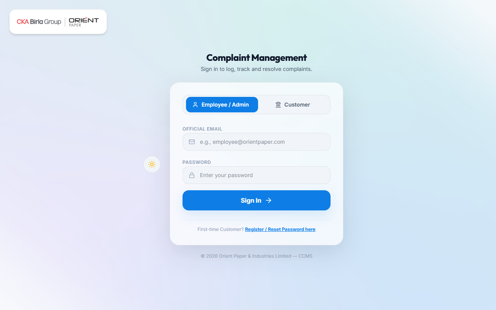
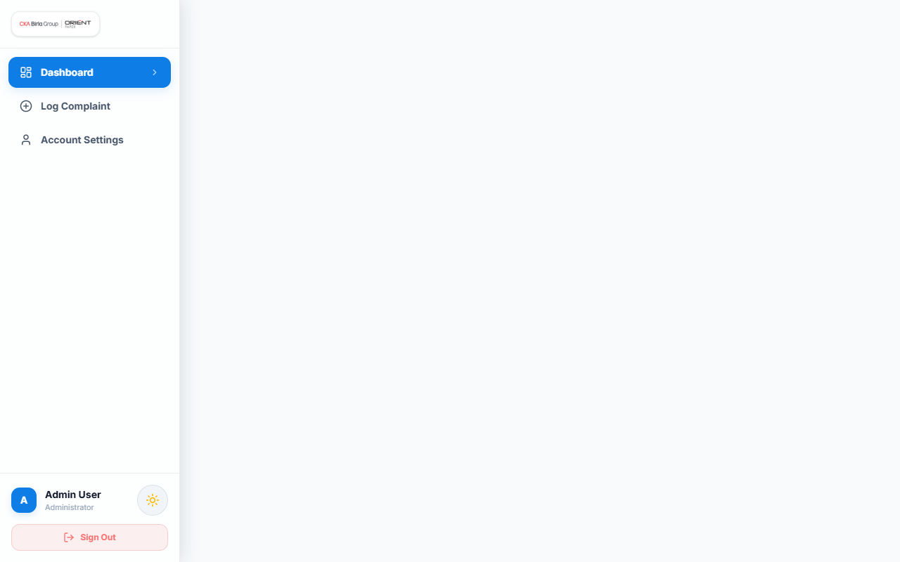
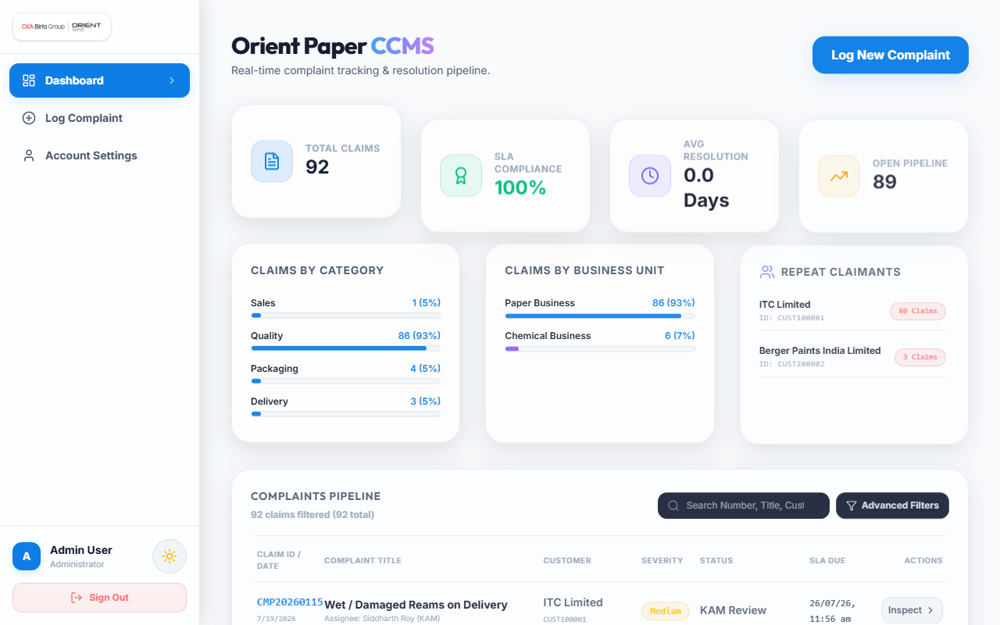
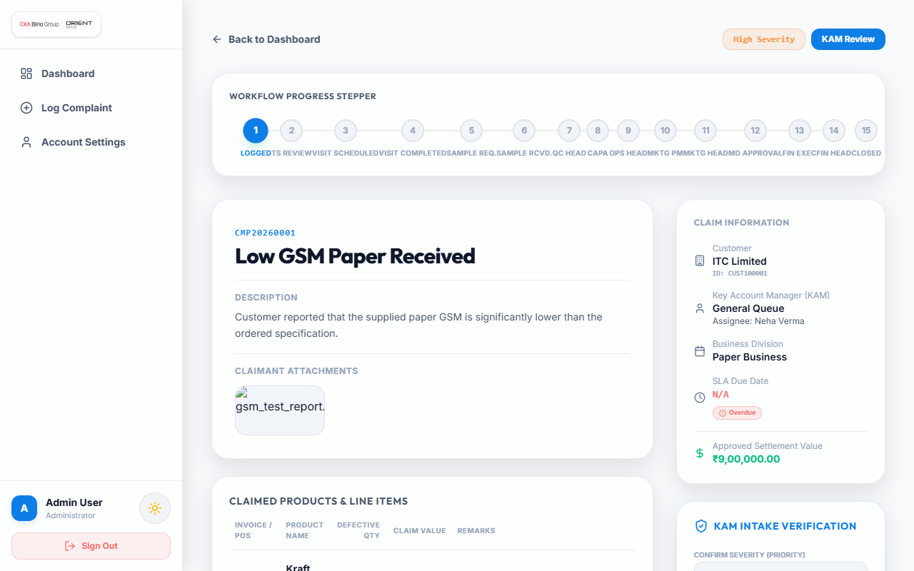
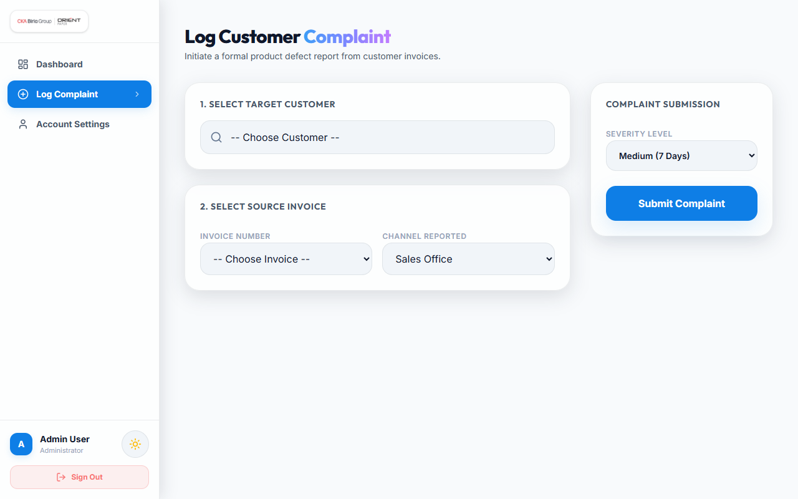
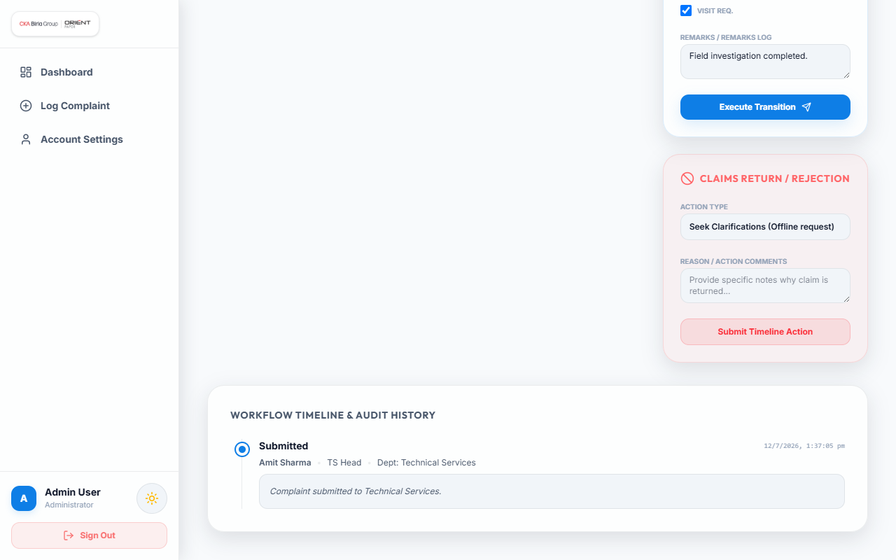

# CCMS
## Customer Complaint Management System — Orient Paper & Mill
### Complaint Transaction + Mock SAP S/4HANA Sync · `backend/` + `frontend/`

---

## What This System Does

This is the complete backend and frontend portal for the Orient Paper & Mill CCMS. It covers:

> **Documentation** — [Architecture](docs/ARCHITECTURE.md) · [API Reference](docs/API.md) · [Database](docs/DATABASE.md) · [Security](docs/SECURITY.md)

| Area | What's Built |
|---|---|
| **Persistence** | MySQL — 20+ tables. Supports transactional referential integrity, lookup tables, relational mappings, and index optimizations |
| **Master Data** | Entities: Customer, User/Employee, Role, Department, Business Unit, Product, Invoice, Lookup Master |
| **Complaint Transaction** | Dynamic Stage 1–11 workflow lifecycle with conditional gates, transitions, and automatic role-based assignment routing |
| **Customer Assignment** | `Customer_Executive_Assignment` for mapping customer reviews directly to designated department executives |
| **Workflow Engine** | Dynamic status-tracking state machine checking authority levels, including support for SLA Pause state variables |
| **Sample Tracking** | Physical sample lifecycle (Requested → Dispatched → Received → Under Testing → Verified) with QC sample contact employee mapping |
| **Customer Visits** | Scheduling customer visits, recording planned vs actual departure/return dates, and mapping multiple visit team members (`Visit_Members`) with specific remarks |
| **CAPA** | Corrective & Preventive Action documentation compiled by Operations during resolution |
| **QC Responses** | `QC_Attachment_Response` to allow the QC team to upload and comment on visual quality files |
| **Security Hardening** | JWT session tokens in **HTTP-only Cookies**, secure headers via **Helmet**, and API rate limiting |

---

## Screenshots

### Sign in — one system, a portal per role
Each role gets its own accent colour and navigation. The tab system lets you choose between Customer and Employee/Admin profiles.



### Dashboard — your action queue first
KPI tiles split complaints, pending reviews, and resolved statuses, and the action queue lists complaints that the logged-in role can act on right now.



### Complaints — scoped to what you're allowed to see
Access control is fully enforced by the API: customers and employees only see complaints scoped to their specific assignments and departments.



### Complaint detail — the whole journey on one page
Workflow tracker, gate status, line items with defective value computations, sample tracking, CAPA documentation, customer visits, and the SAP credit note.



### New complaint — invoice pulled live from SAP
Select an active invoice number and SAP return data automatically populates line items; users add the defective quantity, reasons, and attach images.



### Audit log — every workflow transition logged
Database-backed workflow logging records status changes, remarks, and user actors at each step of the resolution journey.



---

## Quick Start

The project is split into **`backend/`** (Express API + MySQL) and **`frontend/`** (React + Vite SPA).

### Prerequisites

| | |
|---|---|
| **Node.js** | 18 or newer |
| **MySQL / MariaDB** | Server running locally (default port `3306`) |

You need the MySQL server running and configured.

### 1. Backend Setup (Terminal 1)

```bash
cd backend
npm install                  # Install dependencies
cp .env.example .env         # Setup configuration (set your DB user/password)
npm run init-db              # Creates database tables, schemas, and seeds test data
npm run dev                  # Starts backend server via nodemon on http://localhost:5000
```

### 2. Frontend Setup (Terminal 2)

```bash
cd frontend
npm install                  # Install dependencies
npm run dev                  # Starts React development server on http://localhost:5173
```

Then open **http://localhost:5173** and sign in.

---

## Default Test Logins

These accounts are seeded during `npm run init-db` for verification:

| User Type | Email | Password | Role / Role ID |
|---|---|---|---|
| **Administrator** | `admin@orientpaper.com` | `password123` | Administrator (Role 4) |
| **KAM** | `kam.paper@orientpaper.com` | `password123` | Key Account Manager (Role 3) |
| **TS Executive** | `ts.paper@orientpaper.com` | `password123` | TS Executive (Role 2) |
| **TS Head** | `tshead.paper@orientpaper.com` | `password123` | TS Head (Role 6) |
| **QC Executive** | `qc.paper@orientpaper.com` | `password123` | QC Executive (Role 5) |
| **QC Head** | `qchead.paper@orientpaper.com` | `password123` | QC Head (Role 7) |
| **Ops Executive** | `ops.paper@orientpaper.com` | `password123` | Ops Executive (Role 8) |
| **Ops Head** | `opshead.paper@orientpaper.com` | `password123` | Ops Head (Role 9) |
| **Marketing Exec** | `mktg.paper@orientpaper.com` | `password123` | Marketing Executive (Role 10) |
| **Marketing Head** | `mktghead.paper@orientpaper.com` | `password123` | Marketing Head (Role 11) |
| **Finance Exec** | `fin.paper@orientpaper.com` | `password123` | Finance Executive (Role 12) |
| **Finance Head** | `finhead.paper@orientpaper.com` | `password123` | Finance Head (Role 14) |
| **Customer** | `paper.procurement@itc.in` | `password123` | Customer Account |
| **Customer (HB)** | `hb@itc.in` | `hb123` | Customer (HB Division) |
| **Customer (YB)** | `yb@itc.in` | `yb123` | Customer (YB Division) |

---

## Project Structure

```
CCMS/
├── backend/                       ← Express API + MySQL Connection
│   ├── config/                        ← Database connection pools, seeding, and migration runners
│   ├── controllers/                   ← Route controller endpoints
│   ├── middleware/                    ← Route guards, file uploads, error handlers
│   ├── routes/                        ← API routes definition
│   ├── uploads/                       ← Temporary folder for file uploads
│   ├── utils/                         ← Response helpers
│   ├── server.js                      ← Server configuration
│   ├── .env                           ← Environment configuration (Git-ignored)
│   └── package.json
├── frontend/                      ← React Client Application
│   ├── src/                           ← React components, pages, hooks, contexts
│   ├── public/                        ← Static assets and icons
│   ├── package.json
│   └── vite.config.js
├── database/                      ← Database script folders
│   ├── migrations/                    ← Versioned schema migrations
│   └── ccms.sql                       ← Base schema SQL structure definition
├── docs/                          ← Reference documents
│   └── screenshots/                   ← Screenshots of the running application
├── ccms_postman_collection.json   ← Postman collections for integration testing
└── README.md                      ← Main project documentation
```

---

## Database Schemas & Entities

The application consists of the following key tables and database entities:

### Master Data Entities
*   **Customer_Master**: Store customer attributes including regions, segment levels, app access authorizations, and status controls.
*   **Employee_Master**: Register organization employees mapped to corresponding departments and dynamic roles.
*   **Login_Master**: Centralize emails and secure bcrypt-hashed passwords for authentication.
*   **Product_Master**: Store SKU codes, units of measurement, and categories (Paper/Chemical).
*   **Invoice_Master**: Store invoice details, unit prices, distribution channels, and quantities for verification checks.

### Transactional Entities
*   **Complaint_Header**: Register complaints, tracking the current status stage, priorities, sources, and SLA pause states.
*   **Complaint_Line_Item**: Capture defective quantities per invoice line item and calculate computed defect values.
*   **Complaint_Workflow_Log**: Immutable transaction records logging transitions, remarks, and user actors.
*   **Customer_Executive_Assignment**: Mappings to assign customer reviews directly to internal department executives.
*   **Technical_Service_Details**: Document TS team feedback.
*   **Visit_Details**: Track customer visits with planned/actual timestamps, findings, outcomes, and signatures.
*   **Visit_Members**: Assign multiple team members to a customer visit.
*   **Sample_Tracking**: Track physical quality samples from dispatch to verification testing.
*   **QC_Attachment_Response**: Record feedback/analysis from the QC team on uploaded attachments.
*   **CAPA_Analysis**: Operations analysis logging root-cause descriptions, corrective actions, and preventative plans.
*   **Settlement_Details**: Finalize complaint settlement resolutions and credit notes.
*   **Credit_Note**: Write back SAP credit note tracking numbers on closure.
