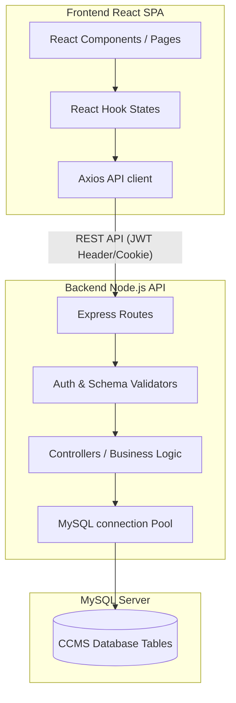
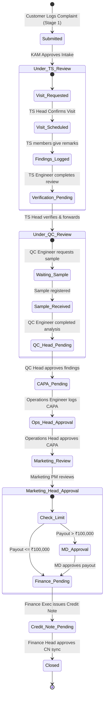

# System Architecture & Workflows

This document outlines the high-level architecture, module dependencies, and state-machine lifecycle of complaints in the Customer Complaint Management System (CCMS).

---

## 🏛️ High-Level Design (MVC Pattern)

CCMS follows a decoupled **Client-Server Architecture** with a relational MySQL backend:

---

## 🔄 Complaint Lifecycle State Machine

A complaint progresses sequentially through different departments. Each step updates `Complaint_Status_ID`, reassigns the `Current_Assignee_ID` to the responsible user, and logs the action in `Complaint_Workflow_Log`.

---

## 📑 Detailed Stage Descriptions

### Stage 1: Intake & KAM Verification
* **Action:** Customer logs complaint on the portal with defective product details, invoice reference, and image uploads. Status defaults to `Submitted (17)`.
* **KAM Review:** Mapped Key Account Manager (KAM) verifies eligibility and details. They assign a severity level (`Low`, `Medium`, `High`, `Critical`), recalculating the SLA due date.
* **Transition:** Forwarded to Technical Services. Status: `Under TS Review (18)`.

### Stage 2: Technical Service & On-Site Visits
* **Workflow:** Assigned TS Engineer performs an initial review.
  * **Option A (Direct Forward):** If no visit is required, TS Engineer forwards findings to TS Head for verification.
  * **Option B (Visit Required):** TS Engineer requests a customer visit.
    * **TS Head Confirmation:** TS Head schedules the visit, assigning up to 3 engineers/executives and setting departure/return dates. This pauses the SLA (`SLA_Paused = TRUE`, Reason: `Customer Visit Scheduled`).
    * **Field Remarks:** Mapped visit members must submit their remarks on their respective dashboards.
    * **Completion:** Once all members submit remarks, the complaint returns to the TS Engineer to complete the visit review, resuming the SLA.
* **Verification:** TS Head reviews the final technical observations and clicks "Forward to QC".
* **Transition:** Status: `Under QC Review (21)`.

### Stage 3: Quality Control Lab Testing
* **Workflow:** QC Engineer logs in to perform lab checks.
  * **Sample Tracking:** If a physical sample is needed, the engineer selects "Request Sample" and sets a contact employee. The SLA pauses (`SLA_Paused = TRUE`, Reason: `Waiting for Customer Sample`).
  * **Receipt:** Once the sample is delivered, the engineer registers its arrival and condition. The SLA resumes and resets to exactly **3 business days** to ensure quick turnaround.
  * **Analysis:** The QC Engineer inputs testing observations, replies to each claimant attachment with specialized comments/images, and forwards the results.
* **Approval:** QC Head approves and signs off on sample findings.
* **Transition:** Forwarded to Operations. Status: `CAPA Pending (22)`.

### Stage 4: Corrective & Preventive Action (CAPA)
* **Workflow:** Operations Engineer investigates the factory/plant root causes.
  * The engineer submits the CAPA form detailing `Root Cause Analysis`, `Corrective Action`, `Preventive Action`, and sets a targeted completion date.
* **Approval:** Operations Head reviews the CAPA record and approves it.
* **Transition:** Status: `Marketing Review (24)`.

### Stage 5: Commercial Payout & Executive Escalations
* **Marketing PM Review:** Marketing Product Manager/Executive reviews the claim and recommends progression.
* **Marketing Head Approval:** Marketing Head approves the claim payout value.
  * **MD Threshold Check:** The system checks the total defective value against the configuration key `MD_APPROVAL_LIMIT` (default: ₹100,000.00).
    * If payout value > threshold ➔ Status transitions to `MD Approval (26)`, assigned to Managing Director.
    * If payout value <= threshold ➔ Bypasses MD, status transitions to `Finance Pending (27)`.
* **MD Approval:** MD reviews escalated payouts and signs off.

### Stage 6: Credit Note & Sign-off Closure
* **Credit Note Sync:** Finance Executive prepares details (CN Number, Date, Company Code, Fiscal Year) to sync with SAP systems. Status transitions to `Credit Note Pending (83)`.
* **Closing:** Finance Head confirms receipt of the SAP Credit Note, signs off, and closes the complaint.
* **Transition:** Status: `Closed (28)`.

---

## ⏸️ SLA Pause & Reopen Rules

### SLA Pause Mechanism
The SLA timer dynamically pauses and blocks downstream workflow progression during two specific phases:
1. **Customer Visit Scheduled:** Paused from the moment the TS Head confirms the visit until the TS Engineer completes the visit analysis.
2. **Offline Clarification Loop:** TS Head or Finance Head can trigger "Seek Clarification", assigning the complaint back to the KAM to clarify details offline. This pauses the SLA and locks the complaint until the KAM submits "Clarification Done".

### 7-Day Reopen Rule
* Closed complaints can be reopened by customers within **7 calendar days** of closure. Reopening resets the status to `Under TS Review (18)`.
* After 7 days, reopening is blocked for customers.
* Key Account Managers (KAMs) and Administrators can bypass this rule and reopen complaints at any time.
