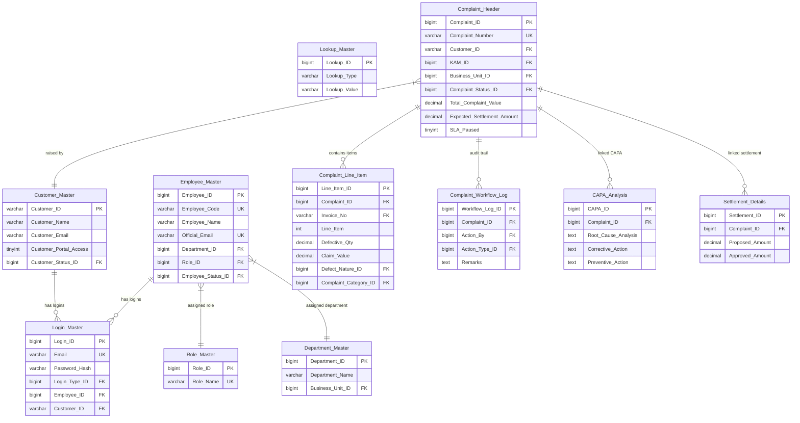

# Database Schema & Data Dictionary

This document details the MySQL database tables, primary keys, relationships, index structures, and configuration values that drive the CCMS workflow engine.

---

## 📊 Relational Database Diagram

---

## 🗃️ Table Dictionary

### 1. Lookup_Master
Stores categorized system variables (statuses, priorities, sources, defect categories, defect natures, sample statuses, settlement types, and workflow actions).
* `Lookup_ID` (BIGINT, PK): Unique lookup identifier
* `Lookup_Type` (VARCHAR(50)): Category grouping (e.g. `Complaint_Status`, `Priority`, `Defect_Nature`)
* `Lookup_Value` (VARCHAR(150)): Readable value (e.g. `Submitted`, `Under TS Review`, `Closed`)

### 2. Customer_Master
Stores customer records imported from SAP.
* `Customer_ID` (VARCHAR(20), PK): SAP customer code (e.g. `CUST100001`)
* `Customer_Name` (VARCHAR(150)): Company name
* `Customer_Email` (VARCHAR(150), Unique): Email address
* `Customer_Portal_Access` (TINYINT): Access enabled (`1` = Yes, `0` = No)
* `Customer_Status_ID` (BIGINT, FK): Reference to `Lookup_Master` (`Active`/`Inactive`)
* `Reopen_Limit_Days` (INT): Customer reopen window threshold (defaults to `7` days if NULL)

### 3. Login_Master
Stores credentials for portal logins (both employees and customers).
* `Login_ID` (BIGINT, PK, Auto Increment): Login identifier
* `Email` (VARCHAR(150), Unique): Login email
* `Password_Hash` (VARCHAR(255)): Bcrypt password hash
* `Login_Type_ID` (BIGINT, FK): Reference to type (1 = Customer, 2 = Employee, 3 = Vendor, 4 = Admin)
* `Employee_ID` (BIGINT, FK, Nullable): Associated profile in `Employee_Master`
* `Customer_ID` (VARCHAR(20), FK, Nullable): Associated profile in `Customer_Master`

### 4. Employee_Master
Stores internal executive and engineer profiles.
* `Employee_ID` (BIGINT, PK): Unique ID (seeded from `100001`)
* `Employee_Code` (VARCHAR(20), Unique): Unique employee code (e.g. `EMP100001`)
* `Employee_Name` (VARCHAR(150)): Full name
* `Official_Email` (VARCHAR(150), Unique): Internal email
* `Department_ID` (BIGINT, FK): Reference to `Department_Master`
* `Role_ID` (BIGINT, FK): Reference to `Role_Master`
* `Employee_Status_ID` (BIGINT, FK): Reference to status lookup
* `Is_Active` (TINYINT): Active status (`1` = Yes, `0` = No)

### 5. Complaint_Header
Stores summary details for registered customer complaints.
* `Complaint_ID` (BIGINT, PK, Auto Increment): Internal complaint key
* `Complaint_Number` (VARCHAR(30), Unique): Unique reference number (e.g. `CMP20260055`)
* `Customer_ID` (VARCHAR(20), FK): Reference to customer who filed the complaint
* `KAM_ID` (BIGINT, FK): Reference to `KAM_Master` profile
* `Business_Unit_ID` (BIGINT, FK): Business unit ID (1 = Paper Division, 2 = Chemicals Division)
* `Complaint_Status_ID` (BIGINT, FK): Reference to status in `Lookup_Master`
* `Total_Complaint_Value` (DECIMAL(15,2)): Sum of defective line item costs
* `Expected_Settlement_Amount` (DECIMAL(15,2)): Payout amount. Defaults to match `Total_Complaint_Value`
* `SLA_Due_Date` (DATETIME): System calculated deadline date based on severity
* `SLA_Paused` (TINYINT): Pause flag (`1` = Paused, `0` = Active)
* `SLA_Pause_Reason` (VARCHAR(150)): Description of pause (e.g. `Clarification Requested`)

### 6. Complaint_Line_Item
Stores the individual products and invoices claimed as defective.
* `Line_Item_ID` (BIGINT, PK, Auto Increment): Line identifier
* `Complaint_ID` (BIGINT, FK): Parent complaint reference
* `Invoice_No` (VARCHAR(50), FK): Mapped invoice reference
* `Line_Item` (INT): Invoice sequence item number
* `Defective_Qty` (DECIMAL(12,3)): Claimed quantity
* `Claim_Value` (DECIMAL(15,2)): Value calculated as `Defective_Qty * Invoice Unit_Price`
* `Complaint_Category_ID` (BIGINT, FK): Category reference (e.g. `Quality`, `Packaging`)
* `Defect_Nature_ID` (BIGINT, FK): Specific nature reference (e.g. `Moisture Variation`)

---

## ⚡ Indexing & Optimization

The database is optimized for workflow speed and visibility filtering:
* **Workflow Logs Index:** `idx_workflow` on `Complaint_Workflow_Log(Complaint_ID)` is created to retrieve audit trails instantly.
* **Customer Invites Index:** Unique constraint on `Login_Master(Email)` to prevent duplicate registrations.
* **Line Items Index:** Index on `Complaint_Line_Item(Complaint_ID)` for fast details loading.
